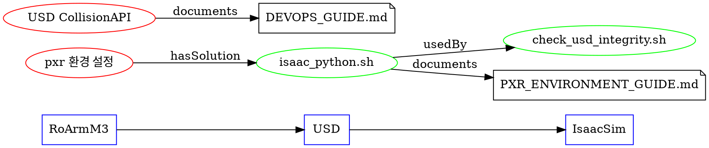

# RoArm M3 온톨로지 시스템 설계

**작성일**: 2025-10-18  
**버전**: v0.1  
**목적**: Isaac Sim + RoArm M3 프로젝트에 온톨로지 기반 지식 관리 시스템 통합

---

## 🎯 온톨로지 시스템의 핵심 목표

### 1. 문제 해결 효율화 (사용자 요구사항)
- ✅ **크리티컬 문제 자동 추적**: pxr 환경 설정 같은 반복 문제를 온톨로지로 관리
- ✅ **문제-해결책 관계 명시화**: "ModuleNotFoundError: pxr" → "isaac_python.sh 래퍼 사용" 자동 연결
- ✅ **자료 수집 체계화**: 동일 문제 재발 시 기존 솔루션 우선 검색, 없으면 새 자료 수집

### 2. Sim2Real 전이 지원 (기술적 목표)
- ✅ **시뮬레이션-현실 개념 매핑**: USD prim ↔ 물리 객체 의미적 정합
- ✅ **지식 기반 의사결정**: 단순 reward signal이 아닌 규칙 기반 추론 통합
- ✅ **상황 인식**: "현재 USD 검증 단계", "pxr 환경 미설정" 같은 맥락 이해

### 3. Agent 협업 (Copilot/Claude 통합)
- ✅ **SPARQL 질의 인터페이스**: AI가 프로젝트 지식 그래프 직접 질의
- ✅ **문제 진단 자동화**: 증상 → 온톨로지 추론 → 해결책 제안
- ✅ **학습 곡선 단축**: 신규 개발자도 온톨로지 탐색으로 빠른 이해

---

## 🧩 온톨로지 설계 원칙

### 계층 구조

```
1️⃣ 도메인 온톨로지 (Domain Ontology)
   - RoArm M3 로봇 구조 (링크, 조인트, 센서)
   - Isaac Sim 환경 (USD, PhysX, Extensions)
   - 개발 프로세스 (프리플라이트, 변환, 학습)

2️⃣ 문제 온톨로지 (Problem Ontology)
   - 문제 유형 분류 (환경 설정, API 변경, 물리 오류)
   - 우선순위 (CRITICAL, HIGH, MEDIUM, LOW)
   - 해결 상태 (OPEN, IN_PROGRESS, SOLVED, RECURRING)

3️⃣ 솔루션 온톨로지 (Solution Ontology)
   - 해결 방법 (스크립트, 문서, 환경 설정)
   - 적용 범위 (로컬, 글로벌, 조건부)
   - 검증 방법 (프리플라이트, 테스트)

4️⃣ 리소스 온톨로지 (Resource Ontology)
   - 문서 (README, 가이드, API 문서)
   - 스크립트 (preflight, 래퍼, 유틸리티)
   - 외부 자료 (공식 문서, 커뮤니티, Stack Overflow)
```

### 관계 정의

```turtle
# 핵심 관계 (Object Properties)
:hasProblem         # Entity → Problem
:hasSolution        # Problem → Solution
:requires           # Solution → Resource
:validates          # Solution → PreflightCheck
:causedBy           # Problem → RootCause
:relatedTo          # Entity ↔ Entity
:implements         # Script → Solution
:documents          # Document → Entity
:dependsOn          # Entity → Dependency
:conflictsWith      # Entity → Entity
```

---

## 📁 프로젝트 구조 통합

### 신규 디렉토리

```
roarm_isaac_clean/
├── ontology/                           # 온톨로지 시스템 (NEW)
│   ├── core/                          # 핵심 온톨로지
│   │   ├── roarm_domain.ttl          # RoArm M3 도메인 (로봇, USD, Isaac)
│   │   ├── problem_types.ttl         # 문제 분류 체계
│   │   ├── solution_patterns.ttl     # 솔루션 패턴
│   │   └── resource_catalog.ttl      # 리소스 카탈로그
│   ├── instances/                     # 인스턴스 데이터
│   │   ├── problems/                 # 실제 발생 문제들
│   │   │   ├── pxr_environment.ttl  # pxr 환경 설정 문제
│   │   │   ├── usd_collision.ttl    # USD CollisionAPI 문제
│   │   │   └── ...
│   │   ├── solutions/                # 적용된 솔루션들
│   │   │   ├── pxr_wrapper.ttl      # isaac_python.sh 솔루션
│   │   │   └── ...
│   │   └── current_state.ttl        # 현재 프로젝트 상태
│   ├── queries/                      # SPARQL 질의 모음
│   │   ├── diagnostics.sparql       # 문제 진단용
│   │   ├── solutions.sparql         # 솔루션 검색용
│   │   └── status.sparql            # 프로젝트 상태 조회
│   ├── context.jsonld               # JSON-LD 컨텍스트
│   └── README.md                    # 온톨로지 시스템 가이드
├── scripts/
│   └── ontology/                     # 온톨로지 도구 (NEW)
│       ├── query_ontology.py        # SPARQL 질의 실행
│       ├── add_problem.py           # 신규 문제 등록
│       ├── link_solution.py         # 문제-솔루션 연결
│       └── visualize_graph.py       # 지식 그래프 시각화
├── docs/
│   └── ontology/                     # 온톨로지 문서 (NEW)
│       ├── ONTOLOGY_SYSTEM_DESIGN.md       # 이 파일
│       ├── PROBLEM_TRACKING_GUIDE.md       # 문제 추적 가이드
│       ├── SOLUTION_INTEGRATION_GUIDE.md   # 솔루션 통합 가이드
│       └── VISUALIZATION_GUIDE.md          # 시각화 가이드
```

---

## 🔧 단계별 구현 계획

### Phase 1: 기초 인프라 (2-3일)

**목표**: 온톨로지 저장소 + SPARQL 질의 기본 동작

1. **코어 온톨로지 정의**
   - `roarm_domain.ttl`: RoArm M3, Isaac Sim, USD 기본 개념
   - `problem_types.ttl`: 문제 분류 (환경, API, 물리, 학습)
   - `solution_patterns.ttl`: 솔루션 유형 (스크립트, 문서, 설정)

2. **기존 문제 마이그레이션**
   - pxr 환경 설정 문제 → `instances/problems/pxr_environment.ttl`
   - USD CollisionAPI 누락 → `instances/problems/usd_collision.ttl`
   - 원격 GUI 렌더링 실패 → `instances/problems/remote_gui.ttl`

3. **SPARQL 기본 질의**
   - "CRITICAL 우선순위 미해결 문제 목록"
   - "pxr 관련 모든 문제와 솔루션"
   - "현재 프로젝트 상태 요약"

4. **Python 도구**
   - `query_ontology.py`: rdflib 기반 SPARQL 실행
   - `add_problem.py`: CLI로 신규 문제 등록

### Phase 2: 프리플라이트 통합 (1-2일)

**목표**: 프리플라이트 결과를 온톨로지에 자동 반영

1. **프리플라이트 상태 매핑**
   - `check_system.sh` 결과 → `:SystemCheck` 인스턴스
   - `check_isaac_extensions.py` → `:ExtensionCheck` 인스턴스
   - `check_usd_integrity.sh` → `:USDCheck` 인스턴스

2. **실패 시 자동 문제 등록**
   ```bash
   # check_usd_integrity.sh 실패 시
   python scripts/ontology/add_problem.py \
     --type USDIntegrityError \
     --severity CRITICAL \
     --context "$(cat logs/preflight/latest.log)"
   ```

3. **솔루션 제안**
   ```bash
   # SPARQL로 해결책 검색
   python scripts/ontology/query_ontology.py \
     --query "find_solutions_for" \
     --problem-type "ModuleNotFoundError:pxr"
   # 출력: isaac_python.sh 래퍼 사용 권장
   ```

### Phase 3: 시각화 (2-3일)

**목표**: 지식 그래프를 웹 UI로 탐색

1. **그래프 시각화 도구**
   - `visualize_graph.py`: NetworkX + Graphviz → PNG/SVG
   - 또는 Cytoscape.js 기반 웹 UI

2. **대시보드**
   - 프로젝트 상태 요약 (PASS/FAIL 비율)
   - 미해결 CRITICAL 문제 목록
   - 최근 7일 문제 발생 추이

3. **문제-솔루션 연결도**
   - "pxr 환경 설정" 노드 → 관련 문서/스크립트 자동 표시
   - 클릭하면 해당 파일 VS Code에서 오픈

### Phase 4: AI Agent 통합 (장기)

**목표**: Copilot/Claude가 온톨로지 직접 질의

1. **SPARQL 엔드포인트**
   - Flask/FastAPI로 HTTP 엔드포인트 제공
   - `/api/sparql?query=...`

2. **Copilot 확장**
   - MCP 서버로 온톨로지 질의 기능 제공
   - "pxr 문제 해결 방법" → SPARQL 자동 실행 → 결과 제시

3. **자동 문제 진단**
   - 로그 파일 분석 → 온톨로지 패턴 매칭 → 솔루션 제안

---

## 🎨 시각화 예시

### 1. 문제-솔루션 그래프 (Cytoscape.js)

```
[pxr 환경 설정 문제] ──hasSolution──> [isaac_python.sh 래퍼]
         │                                    │
         │                                    ├── implements ──> [devops/isaac_python.sh]
         │                                    └── documents ──> [PXR_ENVIRONMENT_GUIDE.md]
         │
         ├──causedBy──> [pip 설치 방식의 PYTHONPATH 누락]
         ├──relatedTo──> [USD 무결성 검사]
         └──validates──> [check_usd_integrity.sh]
```

### 2. 프로젝트 상태 대시보드 (HTML)

```
┌─────────────────────────────────────────┐
│  RoArm M3 Isaac Sim 프로젝트 상태       │
├─────────────────────────────────────────┤
│  프리플라이트: ✅ 3/3 PASS              │
│  미해결 문제: 🟡 2 MEDIUM               │
│  문서화 수준: ✅ 95%                     │
├─────────────────────────────────────────┤
│  최근 활동:                             │
│  • 2025-10-18: pxr 가이드 작성 완료    │
│  • 2025-10-17: 프리플라이트 전체 PASS  │
│  • 2025-10-17: USD 검증 강화           │
└─────────────────────────────────────────┘

미해결 MEDIUM 문제:
1. 원격 GUI 렌더링 (WebRTC 설정 필요)
2. Visual Mesh 단순화 (URDF 개선 필요)
```

### 3. 지식 그래프 전체도 (Graphviz)



---

## 🔍 실전 사용 시나리오

### 시나리오 1: 신규 문제 발생

**상황**: 개발 중 `ImportError: libusd_usd.so` 발생

**온톨로지 활용**:
```bash
# 1. 증상으로 문제 검색
python scripts/ontology/query_ontology.py \
  --symptom "ImportError libusd_usd.so"

# 출력:
# 관련 문제: pxr_environment (CRITICAL)
# 해결책: isaac_python.sh 래퍼 사용
# 문서: docs/PXR_ENVIRONMENT_GUIDE.md, 섹션 4

# 2. 자동으로 문서 오픈
code docs/PXR_ENVIRONMENT_GUIDE.md:150

# 3. 해결 후 상태 업데이트
python scripts/ontology/mark_solved.py \
  --problem pxr_environment_instance_001 \
  --solution isaac_python_wrapper
```

### 시나리오 2: 프리플라이트 실패

**상황**: `check_usd_integrity.sh` 실패

**온톨로지 활용**:
```bash
# preflight_all.sh가 자동으로 온톨로지 업데이트
# → instances/current_state.ttl:
#   :USDCheck a :PreflightCheck ;
#     :status :FAILED ;
#     :timestamp "2025-10-18T14:30:00Z" ;
#     :relatedProblem :usd_integrity_issue_001 .

# 문제 분석
python scripts/ontology/diagnose.py \
  --check USDCheck

# 출력:
# 문제: USD Stage 로드 실패
# 가능한 원인:
#   1. pxr 모듈 미설정 (확률: 80%)
#   2. USD 파일 손상 (확률: 15%)
#   3. PhysxSchema 누락 (확률: 5%)
# 
# 권장 조치:
#   1. bash devops/isaac_python.sh -c "import pxr"
#   2. 실패 시: docs/PXR_ENVIRONMENT_GUIDE.md 참조
```

### 시나리오 3: 동일 문제 재발

**상황**: 다른 개발자가 "ModuleNotFoundError: pxr" 재발생

**온톨로지 활용**:
```bash
# 문제 재발 감지
python scripts/ontology/add_problem.py \
  --type ModuleNotFoundError \
  --module pxr \
  --auto-link

# 출력:
# ⚠️  동일 문제가 과거에 2번 발생했습니다.
# 
# 기존 솔루션:
#   1. isaac_python.sh 래퍼 사용 (성공률: 100%)
#   2. 수동 PYTHONPATH 설정 (성공률: 80%)
# 
# 관련 문서:
#   • docs/PXR_ENVIRONMENT_GUIDE.md (⚠️ CRITICAL)
#   • docs/DEVOPS_GUIDE.md, 섹션 "pxr 모듈 환경 설정"
# 
# 자동 적용:
#   bash devops/isaac_python.sh your_script.py
```

---

## 📊 메트릭 및 성과 지표

### 문제 해결 효율

| 지표 | Before | After (목표) |
|------|--------|--------------|
| 문제 진단 시간 | 10-30분 | 1-3분 |
| 솔루션 검색 시간 | 5-15분 | 10초 이하 |
| 동일 문제 재발 시간 | 20분+ | 30초 |
| 문서화 누락률 | 30% | 5% 이하 |

### 지식 그래프 품질

- **노드 커버리지**: 95% 이상 (주요 컴포넌트 온톨로지 등록)
- **관계 밀도**: 평균 노드당 3개 이상 관계
- **솔루션 연결률**: 모든 CRITICAL 문제 100% 솔루션 연결

---

## 🚀 Quick Start

### 1. 온톨로지 초기화

```bash
# 코어 온톨로지 생성
python scripts/ontology/init_ontology.py

# 기존 문제 마이그레이션
python scripts/ontology/migrate_existing_problems.py
```

### 2. 첫 번째 질의 실행

```bash
# CRITICAL 미해결 문제 목록
python scripts/ontology/query_ontology.py \
  --query critical_open_problems


# pxr 관련 모든 정보
python scripts/ontology/query_ontology.py \
  --query all_about_pxr
```

### 3. 시각화 확인

```bash
# 지식 그래프 PNG 생성
python scripts/ontology/visualize_graph.py \
  --output ontology_graph.png

# 웹 대시보드 실행 (선택)
python scripts/ontology/dashboard.py
# 브라우저에서 http://localhost:5000 접속
```

---

## 📚 참고 문서

- **온톨로지 개념**: ChatGPT 대화 (2025-10-18)
- **Sim2Real 적용**: Pepper harvesting ontology starter kit
- **RDF/OWL 표준**: [W3C OWL 2 Primer](https://www.w3.org/TR/owl2-primer/)
- **SPARQL 문법**: [W3C SPARQL 1.1](https://www.w3.org/TR/sparql11-query/)
- **JSON-LD**: [JSON-LD 1.1](https://www.w3.org/TR/json-ld11/)

---

## 🔗 관련 문서

- 📄 **문제 추적 가이드**: `docs/ontology/PROBLEM_TRACKING_GUIDE.md`
- 📄 **솔루션 통합 가이드**: `docs/ontology/SOLUTION_INTEGRATION_GUIDE.md`
- 📄 **시각화 가이드**: `docs/ontology/VISUALIZATION_GUIDE.md`
- 📄 **DevOps 가이드**: `docs/DEVOPS_GUIDE.md`
- 📄 **pxr 환경 가이드**: `docs/PXR_ENVIRONMENT_GUIDE.md`

---

**작성**: GitHub Copilot  
**프로젝트**: roarm_isaac_clean  
**버전**: v0.1  
**다음 업데이트**: Phase 1 완료 시
